# Projet Docker / Kubernetes — Mini rapport

**Auteurs (binôme)** : Younes OUAMAR & Max PENSO (Master M2 MIAGE GR2)
**Date** : 2026-05-04
**Repo GitHub** : https://github.com/ErgoWmr/task-manager-microservices
**Images Docker Hub** :
- https://hub.docker.com/r/ergowmr/users-service
- https://hub.docker.com/r/ergowmr/tasks-service
- https://hub.docker.com/r/ergowmr/task-manager-front

---

## 1. Sujet retenu

**Application de gestion de tâches** type todo/kanban, déclinée en microservices :

- un service `users-service` qui gère les utilisateurs ;
- un service `tasks-service` qui gère les tâches, avec un champ `assigneeId` qui référence un utilisateur ;
- un appel inter-service `tasks → users` via le DNS Kubernetes pour enrichir une tâche avec les données de son auteur ;
- une **base PostgreSQL partagée** par les deux services (conformément au schéma du sujet, qui montre un seul "Service base de données") ;
- une **gateway** d'abord en Ingress NGINX (palier 12), puis migrée vers **Istio Gateway + VirtualService + DestinationRule** (palier 18) — qui expose `/api/users`, `/api/tasks` et `/` ;
- un **front React** minimaliste (bonus présentation) qui consomme la gateway et permet de manipuler les ressources depuis un navigateur.

L'objectif visé est le palier **18/20**, **atteint et démontré** :
- ✅ palier 16/20 (chaîne complète Postgres → services → gateway → front) ;
- ✅ palier 18/20 (Istio Gateway, mTLS STRICT, RBAC Kubernetes, AuthorizationPolicy zero-trust, scan d'image Docker Hub).

---

## 2. Stack & choix techniques

| Composant     | Choix                                       | Justification                                                                 |
|---------------|---------------------------------------------|-------------------------------------------------------------------------------|
| Backend       | Spring Boot 3.2 / Java 21 / Gradle          | Aligné sur les repos `charroux/*` cités en référence dans le sujet           |
| Inter-service | REST via `RestClient` (Spring 6.1)          | Simplicité, pas de dépendance gRPC ; gRPC en bonus prévu plus tard           |
| Persistance   | PostgreSQL 16 + JPA (Hibernate)             | Pattern conseillé par le sujet (`charroux/noops/postgres`)                   |
| Validation DB | H2 in-memory en local d'abord, Postgres en K8s | Méthodologie explicite du sujet : *"Dans un premier temps … in memory"*  |
| Front         | Vite + React 18 + nginx                     | SPA légère, build statique, servie par nginx → consomme la gateway en relatif |
| Cluster       | minikube + Docker driver                    | Standard du cours, repo `charroux/kubernetes-minikube`                       |
| Gateway       | Ingress NGINX (palier 12) → Istio Gateway (palier 18) | Migration effectuée pour bénéficier du mTLS et des AuthorizationPolicies. Manifests NGINX archivés sous `k8s/legacy/`. |
| Persistance   | PV hostPath 5Gi + PVC ReadWriteOnce         | Strictement comme `charroux/noops/postgres`                                  |

### Écarts assumés vs `charroux/noops/postgres`
1. Image `postgres:16-alpine` au lieu de `postgres:10.1` — la 10.1 est EOL depuis nov 2022, conserver une image avec des CVE non patchées contredit l'esprit du palier 18/20.
2. Mot de passe Postgres dans le **Secret seul** (pas dupliqué dans le ConfigMap comme dans le repo de référence) — meilleure hygiène et alignement avec la sécurité du 18/20.

**Pattern de manifests strictement identique sinon** (Secret + ConfigMap + PV/PVC + Deployment + Service NodePort).

### Limite assumée — secret en clair sur le repo public
Le fichier `k8s/postgres/postgres-secret.yml` contient `POSTGRES_PASSWORD: taskmanagerpwd` en clair. C'est volontaire pour la reproductibilité du déploiement de démo (`./deploy.sh` doit fonctionner sans étape manuelle). En production, ce secret serait géré par **Sealed Secrets**, **External Secrets Operator** ou **HashiCorp Vault**, jamais commité tel quel.

---

## 3. Architecture

Tous les pods app embarquent un **sidecar Envoy** (Istio) — toute communication inter-pod passe par lui en **mTLS STRICT**. Chaque service tourne sous un **ServiceAccount dédié** (RBAC K8s) et n'accepte les requêtes entrantes que des sources explicitement autorisées par une **AuthorizationPolicy** Istio (zero-trust).

```
                            ┌───────────────────────────┐
            navigateur ───▶ │  Istio Ingress Gateway    │  taskmanager.local
                            │  (port-forward → 8080)    │
                            └──┬───────┬─────────────┬──┘
                               │       │             │
                          /    │       │ /api/users  │  /api/tasks
                               │       │             │
                       ┌───────▼─┐    ┌▼────────────▼─────┐
                       │ frontend│    │ users-svc          │
                       │ React + │    │ Spring Boot 2x     │◀─┐
                       │ nginx 2x│    │ + sidecar Envoy    │  │ mTLS via sidecars
                       │ +sidecar│    └─────────┬──────────┘  │ (DNS K8s)
                       └─────────┘              │             │
                                                ▼             │
                                       ┌─────────────────┐    │
                                       │ tasks-svc       ├────┘
                                       │ Spring Boot 2x  │
                                       │ + sidecar Envoy │
                                       └────────┬────────┘
                                                │ JDBC (mTLS L4 via sidecars)
                                       ┌────────▼────────────┐
                                       │ PostgreSQL 16       │
                                       │ 1 pod + sidecar     │ taskmanagerdb
                                       │ PVC 5Gi RWO         │ envFrom Secret+ConfigMap
                                       └────────┬────────────┘
                                                │
                                       ┌────────▼────────────┐
                                       │ PV hostPath /mnt/data│
                                       └─────────────────────┘
```

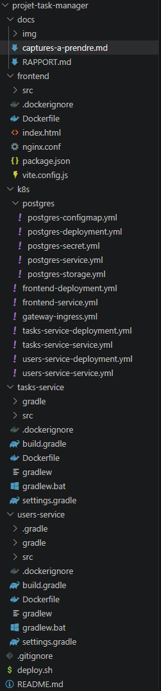

---

## 4. Roadmap réalisée

### ✅ Palier 10/20 — 1 service en local + image + K8s

- Service `users-service` codé en Spring Boot, REST CRUD users en mémoire.
- `Dockerfile` multi-stage (build Gradle dans une image `gradle:8.5-jdk21`, run dans une image `eclipse-temurin:21-jre`) → image `ergowmr/users-service:1` poussée sur Docker Hub.
- `Deployment` Kubernetes (2 replicas, probes readiness/liveness sur `/status`, resources limits) + `Service` NodePort.

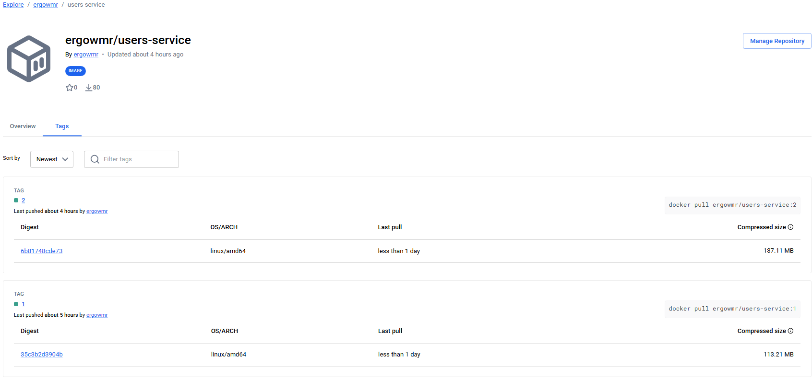
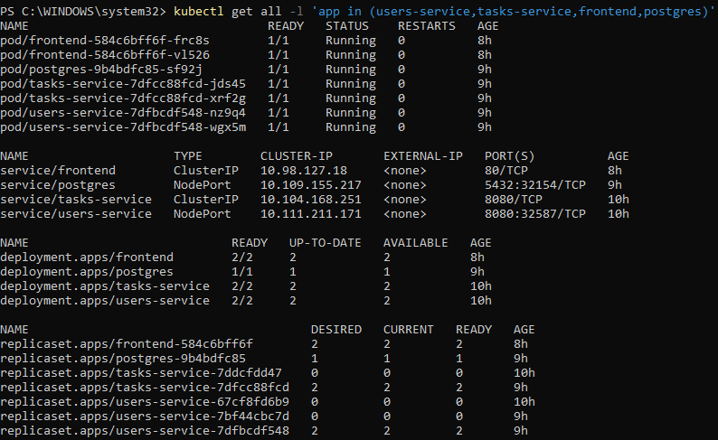

### ✅ Palier 12/20 — Gateway

- Activation de l'addon ingress de minikube (`minikube addons enable ingress`).
- Création d'une `Ingress` avec rewrite-target nginx pour exposer `/api/users(.*)` → `users-service`.
- Sur Windows + driver docker : `minikube tunnel` requis pour exposer l'Ingress sur `127.0.0.1`.
- Test : `curl -H "Host: taskmanager.local" http://127.0.0.1/api/users`.

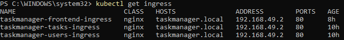
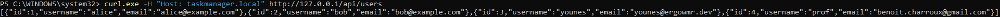

### ✅ Palier 14/20 — 2e service + appel inter-service

- Service `tasks-service` créé sur la même stack, avec une entité `Task(title, description, status, assigneeId)`.
- Endpoint dédié `GET /tasks/{id}/full` qui appelle `users-service` via le DNS Kubernetes (`http://users-service:8080/users/{id}`) pour enrichir la réponse avec l'objet user complet.
- Configuration via variable d'environnement `USERS_SERVICE_URL` (modifiable sans rebuild).
- Mise à jour de la gateway : 2 ressources `Ingress` distinctes (rewrite spécifique par service).

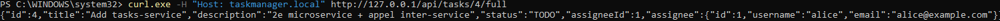

### ✅ Palier 16/20 — Base de données partagée

Suivi de la méthodologie conseillée par le sujet (*"Dans un premier temps … in memory"*) :

1. **Étape 1** : ajout de Spring Data JPA + H2 dans `tasks-service`. Validation locale via `docker run` (image `:2`), CRUD persisté en H2.
2. **Étape 2** : déploiement de PostgreSQL sur K8s — Secret (password), ConfigMap (DB+user), PV hostPath 5Gi + PVC, Deployment 1 pod, Service NodePort. Création préalable du dossier `/mnt/data` sur la VM minikube.
3. **Étape 3** : bascule de `tasks-service` vers Postgres par variables d'environnement (`SPRING_DATASOURCE_URL`, `_USERNAME` depuis ConfigMap, `_PASSWORD` depuis Secret), aucune modification de code (datasource paramétrable depuis le départ).
4. **Étape 4** : migration de `users-service` vers le même Postgres → **base unique partagée** entre les deux services (cf. schéma du PDF du sujet), tables `users` et `tasks`.

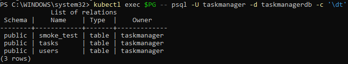
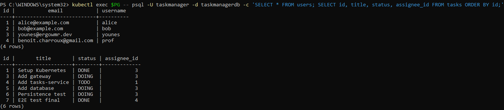
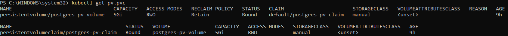
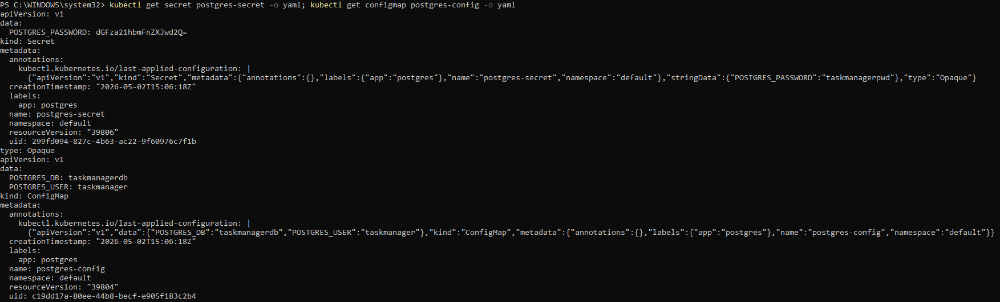

**Détail** : un `seed` idempotent (`try/catch DataIntegrityViolationException` au démarrage) gère la course possible entre les 2 replicas qui démarrent en parallèle.

### ✅ Palier 18/20 — Sécurité

Atteint en 6 phases, chacune avec sa preuve technique.

**Phase 1 — Installation Istio + injection sidecar.** Téléchargement d'`istioctl` 1.29.2, installation profile `default` (istiod + ingressgateway, ~500 MB pour rester sous les 4 GB de RAM minikube), labellisation du namespace `default` avec `istio-injection=enabled`, rolling restart des 4 deployments. Tous les pods passent à `READY 2/2` (app + sidecar Envoy). Correction des Services pour nommer leurs ports (`http`, `tcp-postgres`) — exigence Istio pour identifier le protocole.

**Phase 2 — Migration de la gateway NGINX Ingress → Istio.** Création de `Gateway` + `VirtualService` (3 routes : `/api/users` → users-service, `/api/tasks` → tasks-service, `/` → frontend, avec `rewrite` et `timeouts/retries`) + `DestinationRule` (load balancing `LEAST_REQUEST`, connection pool, outlier detection). Pattern aligné sur `charroux/rentalservice/k8s/base/istio-internal-gateway.yaml`. Les 3 Ingress NGINX sont supprimés du cluster ; leurs manifests sont archivés sous `k8s/legacy/` pour la traçabilité du palier 12.

**Phase 3 — mTLS migration `PERMISSIVE` → `STRICT`** (la doc [istio.io/.../mtls-migration/](https://istio.io/latest/docs/tasks/security/authentication/mtls-migration/) explicitement citée par le PDF du sujet). Démonstration en deux temps :

| Test | PERMISSIVE | STRICT |
|------|-----------|--------|
| Pod hors mesh (namespace `nomesh`) → users-service en plain HTTP | ✅ accepté | ❌ `Connection reset by peer` |
| Pod en mesh (tasks-service avec sidecar) → users-service | ✅ mTLS auto | ✅ mTLS auto |
| Gateway publique → users-service | ✅ | ✅ |
| Inter-service tasks → users via `/full` | ✅ | ✅ |
| tasks-service ↔ Postgres en TCP via sidecars | ✅ | ✅ (mTLS L4) |

**Phase 4 — RBAC Kubernetes.** Un `ServiceAccount` dédié par workload (users-service-sa, tasks-service-sa, frontend-sa, postgres-sa) au lieu du SA `default` partagé. Roles minimaux scopés au strict nécessaire (deny-by-default), `automountServiceAccountToken: false` pour les workloads qui ne touchent pas l'API K8s (frontend nginx, postgres). Vérifié avec `kubectl auth can-i` :

| SA | list pods | list secrets | delete pods |
|---|---|---|---|
| users-service-sa | ✅ yes | ❌ no | ❌ no |
| tasks-service-sa | ✅ yes | ❌ no | ❌ no |
| frontend-sa | ❌ no | ❌ no | ❌ no |
| postgres-sa | ❌ no | ❌ no | ❌ no |

Et preuve en live depuis le pod users-service avec son token : `GET /api/v1/pods` → **HTTP 200** (autorisé), `GET /api/v1/secrets` → **HTTP 403** (refusé).

**Phase 5 — `AuthorizationPolicy` Istio (zero-trust).** Complémentaire au RBAC K8s : limite le **trafic réseau** entre pods sur la base du SPIFFE ID porté par le cert mTLS (`spiffe://cluster.local/ns/<ns>/sa/<sa>`). Matrice :
- users-service : accepte de istio-ingressgateway + tasks-service-sa
- tasks-service : accepte de istio-ingressgateway + frontend-sa
- frontend : accepte de istio-ingressgateway uniquement
- postgres : accepte de users-service-sa + tasks-service-sa uniquement

Démontré par : un curl du pod frontend vers `users-service` → **HTTP 403 Forbidden** (refus Istio), tandis que l'appel légitime gateway → users-service passe.

**Phase 6 — Scan d'image Docker Hub** (lien `https://hub.docker.com/settings/security` du sujet). Activation de Docker Scout pour identifier les CVE des images publiées.

**Note sur la limite Docker Scout** : sur le plan gratuit Docker Personal, l'analyse Scout côté registre est limitée à **1 repository** (la limite était de 3 il y a quelques années, elle a été abaissée). J'ai donc activé Scout via l'UI Docker Hub uniquement sur `users-service` (l'image avec le plus grand nombre de dépendances Java susceptibles d'être affectées), et utilisé **le même outil Docker Scout en local via sa CLI** (`docker scout quickview <image>`) pour les deux autres images, sans quota. C'est exactement le même moteur d'analyse, juste invoqué côté client plutôt que côté serveur.

Résultats concrets remontés par Scout :

- **`tasks-service:3`** — 3 Critical et 21 High côté dépendances applicatives (Spring Boot et ses transitives). Base image `eclipse-temurin:21-jre` propre côté Critical/High. Scout recommande de passer à `eclipse-temurin:26-jre` pour réduire 4 vulnérabilités Medium et 3 Low.
- **`task-manager-front:1`** — 4 Critical et 24 High remontés sur l'image, qui proviennent **tous de la base** `nginx:1-alpine` (le bundle React statique n'introduit aucune CVE applicative). Un simple **refresh** de la même base supprime déjà -4 Critical, -22 High, -29 Medium, -9 Low. Migration vers `nginx:1.30-alpine-slim` ramène à 1 seule vulnérabilité Medium — démonstration parfaite que mettre à jour ses base images est l'action de remédiation à plus fort impact.

Ces analyses sont exploitables : chaque sortie Scout suggère **l'image cible** et **le delta de CVE corrigées**, ce qui permet d'arbitrer un upgrade base image avec une preuve chiffrée.

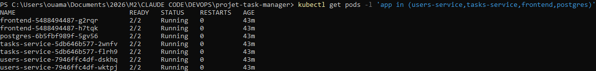
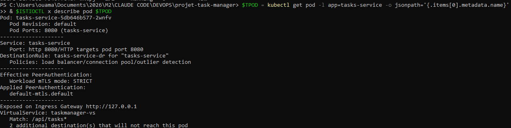
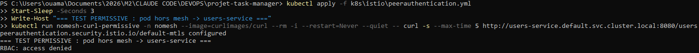
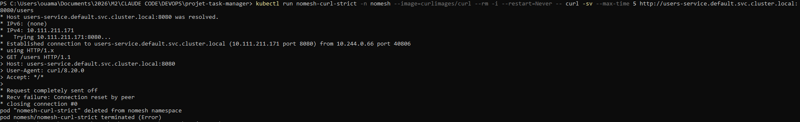
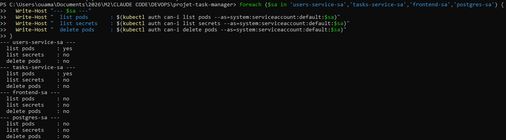
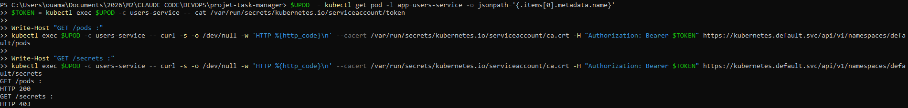
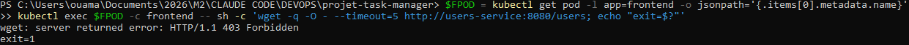
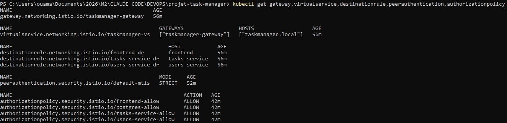
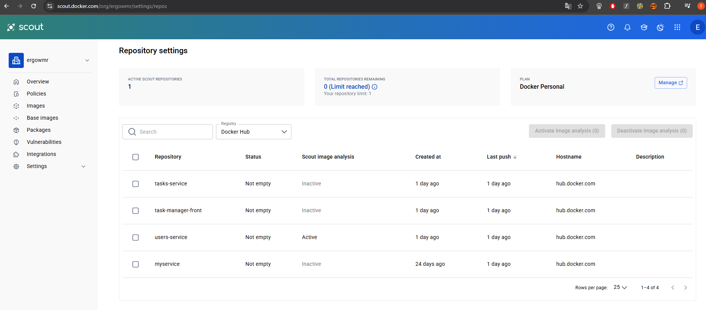
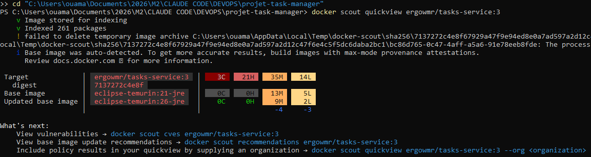
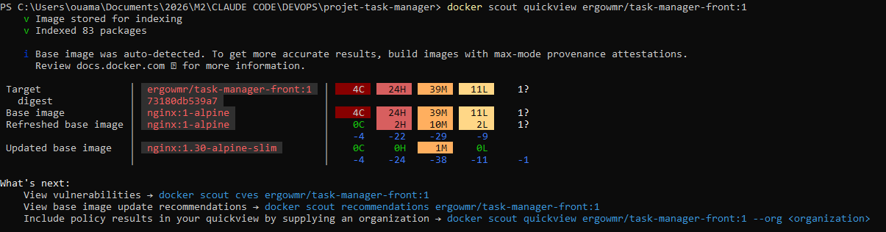

### Bonus — Front React

Un SPA Vite/React, servi par nginx, déployé sur K8s comme les services backend. La gateway expose le front à la racine `/` (Ingress en `pathType: Prefix`). Comme le front et l'API partagent la même origine (`taskmanager.local`), aucun CORS à gérer.

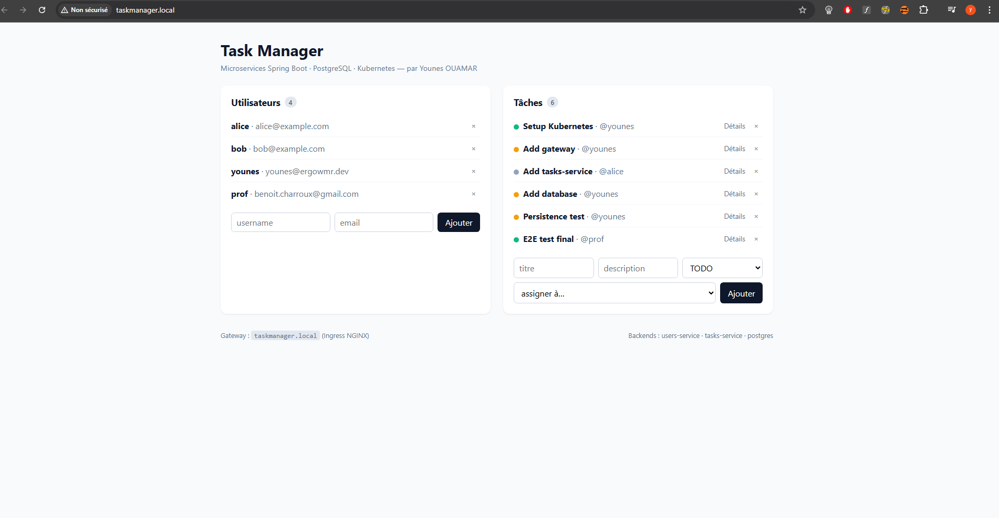
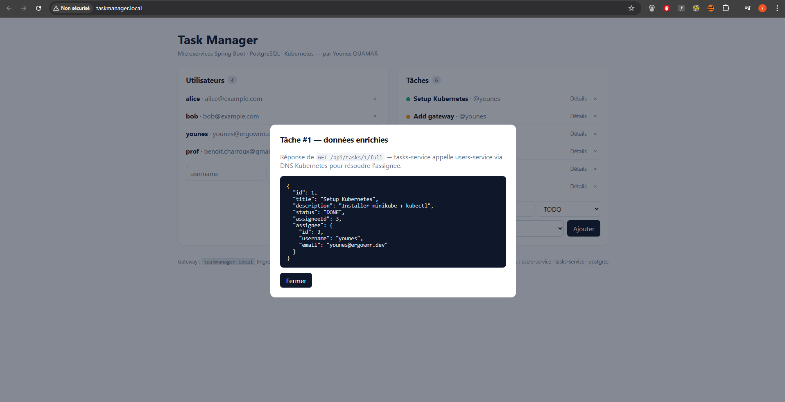

---

## 5. Comment redémarrer le projet from scratch

Tout est scripté dans `deploy.sh` (qui enchaîne build/push images + start minikube + install Istio si absent + apply RBAC + Postgres + apps + couche Istio) :

```bash
cd projet-task-manager
./deploy.sh                                                          # build + push + K8s deploy complet
kubectl port-forward -n istio-system svc/istio-ingressgateway 8080:80 # à laisser tourner dans un autre terminal
```

Puis ajouter `127.0.0.1 taskmanager.local` au fichier hosts (`C:\Windows\System32\drivers\etc\hosts` sur Windows, admin requis) et ouvrir **http://taskmanager.local:8080** (le `:8080` vient du port-forward — on évite ainsi `minikube tunnel` qui exige des droits admin sur Windows pour bind sur le port 80).

Détails complets dans le [README](../README.md).

---

## 6. Conventions du projet

- **Repo Git** : dépôt public https://github.com/ErgoWmr/task-manager-microservices.
- **Images Docker Hub** : namespace `ergowmr/`, tag numérique incrémenté à chaque évolution majeure (ex. `users-service:1` palier 10 → `:2` quand JPA + Postgres sont ajoutés au palier 16). 6 tags publiés au total sur 3 repos, voir détails dans le README.
- **Noms K8s** : `<service>-deployment.yml` / `<service>-service.yml` à la racine de `k8s/`. Manifests groupés par couche dans des sous-dossiers : `k8s/postgres/`, `k8s/istio/`, `k8s/rbac/`, `k8s/legacy/` (NGINX archivé après migration Istio).

---

## 7. Annexe — Captures Google Labs

Profils publics Google Cloud Skills Boost des deux membres du binôme.

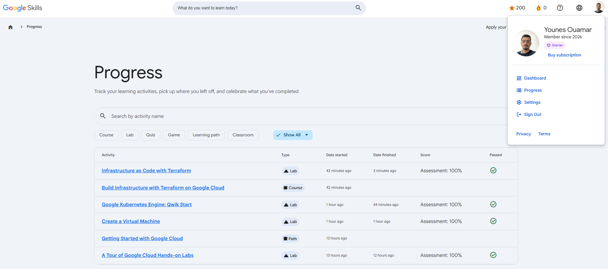
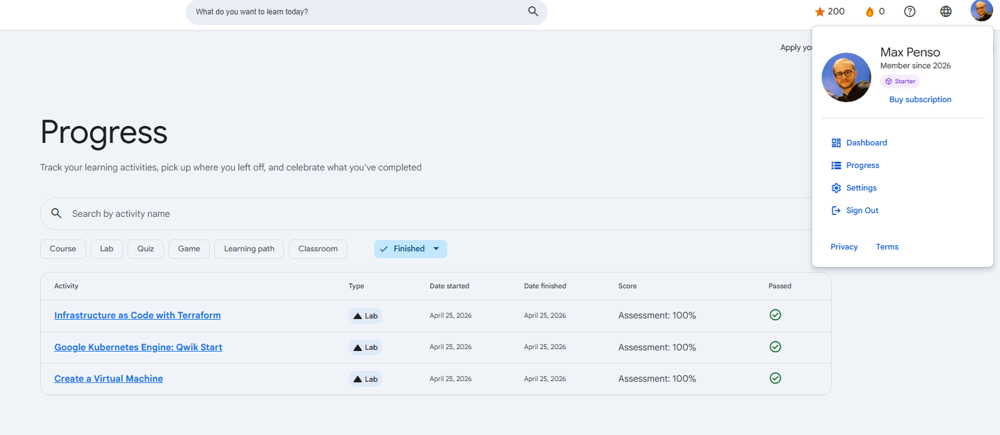

---

## 8. Difficultés rencontrées et solutions

| Difficulté                                                                     | Solution                                                                               |
|--------------------------------------------------------------------------------|----------------------------------------------------------------------------------------|
| Gradle ne tourne pas en local (Java 8 sur la machine, Spring Boot 3.2 demande 17+) | Build via le Dockerfile multi-stage (`gradle:8.5-jdk21` dans le stage 1) → pas de JDK requise sur l'hôte |
| Pod Postgres en `CreateContainerConfigError` au 1er apply                       | Le hostPath `/mnt/data` n'existait pas sur la VM minikube → `minikube ssh -- "sudo mkdir -p /mnt/data && sudo chmod 777 /mnt/data"` |
| `minikube service --url` reste bloqué sur Windows + driver docker               | Remplacé par `kubectl port-forward` pour les tests CLI, et `minikube tunnel` pour l'ingress |
| `imagePullPolicy: IfNotPresent` ne re-pull pas après un `docker push` du même tag | Soit bumper le tag (`:2`, `:3`), soit forcer avec `kubectl rollout restart`            |
| Race au seed entre les 2 replicas → `UNIQUE constraint violated`                | Try/catch `DataIntegrityViolationException` dans `seedOne()`                            |
| Rewrite NGINX initialement faux (`/api/users/1` rewrité en `/1`)                | Pattern `/api/users(.*)` + `rewrite-target: /users$1` (groupe capture inclut le slash) |
| Après installation Istio, le trafic via gateway ne passait plus jusqu'aux pods | Les Services n'avaient pas de `name` sur leurs ports — Istio assumait TCP brut au lieu de HTTP. Ajout de `name: http` (ou `tcp-postgres`) à chaque port |
| `minikube tunnel` échoue silencieusement sur Windows pour le port 80 (besoin admin) | Remplacé par `kubectl port-forward -n istio-system svc/istio-ingressgateway 8080:80` qui n'a pas besoin de privilèges et expose sur localhost:8080 |

---

## 9. Liens utiles

- Repo GitHub : https://github.com/ErgoWmr/task-manager-microservices
- Repos de référence du prof :
  - https://github.com/charroux/kubernetes-minikube
  - https://github.com/charroux/CodingWithKubernetes
  - https://github.com/charroux/noops/tree/main/postgres
  - https://github.com/charroux/rentalservice
